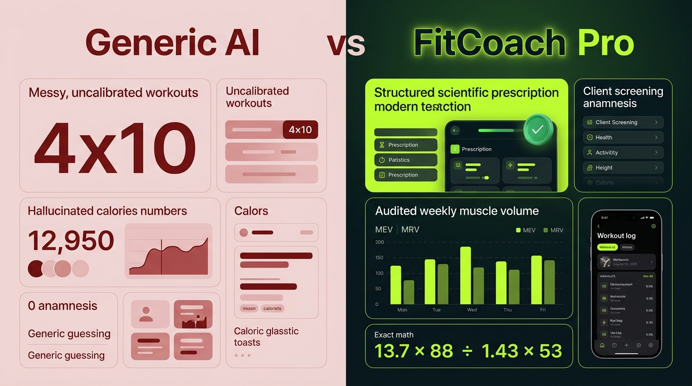
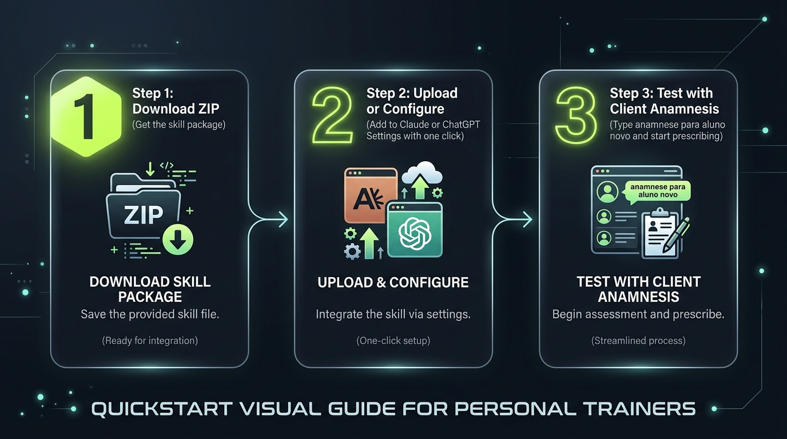
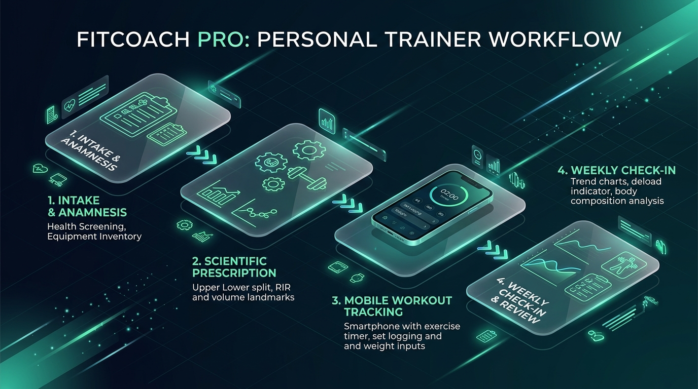
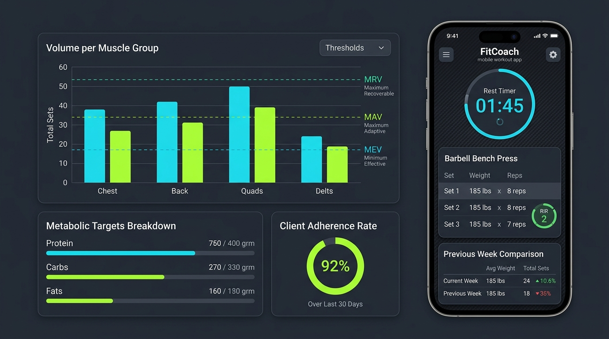

# Trainer's guide

**For people who have never installed anything like this.** It does not assume you know what a terminal, a `.zip` file or a command line is. If you get stuck anywhere, the guide is at fault, not you — open an issue saying where.
* [Commercial Presentation & Pitch](COMMERCIAL-PRESENTATION.md) | Versão em português: [`GUIA-DO-PERSONAL.md`](GUIA-DO-PERSONAL.md)

---

## 1. What this is, in one page

You have probably asked ChatGPT or Claude for a workout. You probably got twelve exercises at four sets each, with no questions about which gym your client trains at, how many days they have, or whether their shoulder hurts. Nice to read, useless to apply.



This changes how the assistant behaves. It is a set of instructions and tools you install once, and it makes the AI work your way: **ask before prescribing, pick exercises from equipment that actually exists, audit volume per muscle group, and admit when it does not know.**

Three things it starts doing that an ordinary chat never does:

**It refuses to prescribe without an intake.** Ask for a program without giving days, equipment, history and injuries, and it asks first. Annoying? Yes. It is also why the plan fits a real client instead of an imaginary one.

**It does not do the math in its head.** Calories, macros, set counts — those come from tested programs bundled with it, not from the AI's "head". This matters because **AI gets arithmetic wrong while looking completely confident**, and you cannot spot it by reading.

**It tells you when it lacks data.** Instead of inventing a number it says things like: *"I can't measure real expenditure yet — 6 of the last 28 days have meals logged and this needs 10."* That looks like a limitation. It is the opposite: it is the only reason to trust the numbers it does give.

### What it never does

It is not the responsible professional. **You prescribe.** It does not diagnose, read lab work, clear anyone to train, or replace a dietitian. And despite everything above, **it can still be wrong** — which is why you review everything before it reaches a client. Read [`DISCLAIMER.md`](../DISCLAIMER.md) once, properly.

---

## 2. Pick your path

Use it directly in your favourite app or browser:

| | **Claude.ai (Recommended)** | **ChatGPT (Custom GPT)** |
| :--- | :--- | :--- |
| **Difficulty** | Super Easy (Normal Chat) | Super Easy (Normal Chat) |
| **Requires terminal?** | **NO** | **NO** |
| **Charts and Dashboard** | **Yes** (Interactive Artifacts and in-chat bars) | **Yes** (Code Interpreter plots and in-chat bars) |
| **Client Pocket Sheet** | **Yes** (Generates `.html` app ready to send) | **Yes** (Generates download file) |
| **Client Messages** | **Yes** (Ready-to-copy WhatsApp cards) | **Yes** (Ready-to-copy WhatsApp cards) |

> 💡 **Recommendation:** If you use Claude, the **Artifacts** feature is ideal because it renders the interactive training app right beside your chat for one-click downloading. If you use ChatGPT Plus, the Custom GPT path works just as well.

---

## 3. Download the files



Same for every path.

1. Open **https://github.com/danilogj/fitcoach-pro**
2. Click the green **`Code`** button
3. Click **`Download ZIP`**
4. It lands in your Downloads folder. **Double-click it** to unpack — on Windows, right-click and choose "Extract all"

You will see a folder called `fitcoach-pro-main` with several folders inside. The ones that matter:

```
claude/
   fitcoach-pro/     ← the skill, English
gpt/                 ← for ChatGPT, English
```

You can ignore the rest.

---

## 4. Install on Claude

1. Go to **claude.ai** and sign in
2. Click your picture (bottom left), open **Settings**, look for **Capabilities** or **Skills**
3. Find the option to **upload a skill**
4. It asks for a `.zip` file. You need to compress **the `fitcoach-pro` folder** (the one inside `claude`):
   - **Windows:** right-click the folder → *Send to* → *Compressed folder*
   - **Mac:** right-click the folder → *Compress*
5. Upload the `.zip` that appears
6. Confirm the skill shows in the list, enabled

> Claude's interface changes from time to time. If the menu names differ, look for **Skills** in settings — it is always around there.

### Check that it worked

Open a new conversation and type exactly this:

> intake for a new client

**It worked** if the reply starts with health screening questions — chest pain, dizziness, medication, pregnancy.
**It did not** if it goes straight to building a workout. The skill is not active; check step 6.

---

## 5. Install on ChatGPT

Here you build a "custom GPT" — a version of ChatGPT with the instructions already inside.

1. Go to **chatgpt.com** and sign in
2. In the sidebar, click **Explore GPTs** → **Create** (top right)
3. Click the **Configure** tab
4. Fill in:
   - **Name:** `FitCoach Pro`
   - **Description:** `Technical assistant for training and nutrition prescription`
5. **Instructions** — the most important step:
   - In the folder you downloaded, open `gpt` → `instructions.md`
   - Open it with Notepad (Windows) or TextEdit (Mac)
   - Select all (Ctrl+A or Cmd+A), copy (Ctrl+C or Cmd+C)
   - Paste into the **Instructions** box
6. **Conversation starters** — open `conversation-starters.md` in the same folder and copy the four lines, one per field
7. **Knowledge** — click *Upload files* and send **every file** inside `gpt/knowledge/`. There are 19; select them all at once
8. **Capabilities** — leave only **Code Interpreter & Data Analysis** ticked. Untick web browsing and image generation: here they only add noise
9. Click **Create** / **Save** and choose whether it stays private

### An honest warning about ChatGPT

The programs that do the calculations are among the files you uploaded, but ChatGPT cannot always run them. **When it cannot, it has been instructed to say so and give ranges instead of exact numbers** — "maintenance somewhere around 2,200 to 2,400 kcal" rather than "2,273 kcal".

To force the calculation in a specific conversation, attach `cli.py` and `metrics.py` directly in the chat and ask: *"run the calculation using these files"*.

On Claude this tends to work by itself. That is the reason for the recommendation.

---

## 6. Your first client, start to finish



Here is a real conversation. **What you type is in bold.**

---

**> I have a new client, let's start the intake**

It replies with seven health screening questions. You ask the client and bring the answers back.

---

**> all answers were no. Male, 34, 175cm, 92kg. Wants to lose fat. Never trained consistently. Can do 3 days, an hour per session. The gym has dumbbells to 40kg, barbell, bench, high and low pulley, leg press, leg extension, leg curl and a pull-up bar. Desk job, sleeps 6 hours.**

It classifies him as a beginner, builds the three-day split, picks exercises from the equipment you listed, audits volume per muscle group and presents the program. It will also flag the 6 hours of sleep — because that changes the prescription.

---

**> what do I need to check before I finalize this?**

It names what it estimated and what you must verify: starting loads, whether the dumbbells really go to 40 kg, the calorie target.

---

**> build his nutrition target**

It calculates (or asks for what is missing) and gives calories and macros as a range, not as a magic number.

---

**> write the sheet he takes to the gym**

You get the finished sheet.

**That is all there is to it.** You talk in plain language. There are no commands to memorise.

---

## 7. Viewing charts and delivering the pocket sheet (100% in Chat)



You never need a terminal or code to view charts or deliver the web app to your client:

### 1. In-Chat Visual Volume Audit
Ask *"audit John's weekly volume"* and the AI renders visual bars right inside the chat window for instant 3-second diagnosis:

```text
📊 WEEKLY VOLUME AUDIT — JOHN
Chest:      ████████████░░░░  12/16 sets  [✅ Optimal MAV]
Back:       ██████████████░░  14/18 sets  [✅ Optimal MAV]
Hamstrings: ████████░░░░░░░░   8/14 sets  [🟡 Low MEV]
```

### 2. Download and Send the Pocket Sheet
* **On Claude:** When you ask for the sheet, Claude opens an interactive side panel (**Artifact**) with the completed web app. Click the **Download** button to save `john-sheet.html` and drag it into WhatsApp or email it to your client. They open it on their phone with an active rest timer, RIR badges, and set logging (100% offline).
* **On ChatGPT:** ChatGPT generates the file for one-click download.

### 3. Ready-to-Copy Client Messages
Every analysis ends with a formatted message ready to forward to your client:

> 📲 **Copy & paste to your client:**
> *"Hey John! Your new training block is ready with extra focus on chest and back. Check your interactive sheet and let me know if you have any questions on the starting loads. Let's get to work! 💪"*

---

## 8. How client memory and context limits work (No-Code State Management)

If you manage 20 clients in a single chat thread for 6 months, the conversation will slow down, consume memory, and the AI will begin forgetting earlier instructions.

To solve this cleanly in everyday chat interfaces, FitCoach Pro separates the **conversation space** from the **data storage**:

```
 📱 ON CLIENT'S PHONE (sheet.html)
    └─> Saves every set, load and rest timer in browser memory (localStorage).
    └─> Works offline and never loses client history.
            │
            ▼ (Client sends weekly summary via WhatsApp/Text)
 💬 IN YOUR CHAT (Claude / ChatGPT)
    ├─> AI analyzes weekly progress in 3 seconds.
    └─> Returns the updated STATE FILE (.md) for that client.
```

### The 3 Levels of Persistence (Choose what fits you best):

1. **The Client "State File" (Universal & Simplest):**
   * The AI maintains a compact Markdown file named `john-doe.md` (< 3 KB) with the client's history (restrictions, current block, weekly weights and load progression).
   * **Advantage:** When starting any fresh chat, simply attach `john-doe.md` and the AI recovers **100% of the client's profile** instantly, taking up less than 1% of the context window!
2. **Claude Projects (The Gold Standard):**
   * If you use Claude Pro/Team, create a Project named *"Personal Training Clients"*.
   * Drop each client's `.md` file in the project's knowledge. Claude remembers every client across any conversation inside that project.
3. **On-Phone Client Storage:**
   * The `sheet.html` pocket web app handles day-to-day logging on the client's phone. You only receive the clean weekly export.

---

## 9. The weekly routine

**Once a week, per client:**

> **> check-in for John. Did 3 of 3 sessions, recovery good, added load on bench and leg press. Weekly average weight 91.2 kg, last week 91.8.**

It gives you a diagnosis and **one specific adjustment** — not a list of suggestions.

**If your client wears a watch or uses an app** (Samsung Health, Garmin, Apple Health, Strava), you can export their data and the assistant reads it all at once: weight, steps, sleep, heart rate. It is covered in the technical guide; have someone set it up once, then it is drag-and-drop.

**Every 8 weeks:**

> **> John finished the block. Analyze it and build the next one.**

---

## 10. Practical Testing with 10 Ready-to-Use Fictitious Clients (Showcase)

To test the system immediately without making up dummy data, we included **10 realistic fictitious clients** in `examples/carteira-10-alunos/`.

Full showcase guide: **[`DEMONSTRACAO-10-ALUNOS.md`](DEMONSTRACAO-10-ALUNOS.md)**.

### The 10 Ready-to-Test Profiles:
1. **`joao-silva/`**: Fat Loss · L4-L5 disc herniation (Zero axial spine load).
2. **`maria-santos/`**: Glute Hypertrophy · ER Physician (Dense 45-min sessions).
3. **`carlos-mendes/`**: Recomposition · Pre-diabetes & Zone 2 Cardio (GLUT4).
4. **`fernanda-lima/`**: Hypertrophy · Complete Beginner · Basic Apartment Gym (Dumbbells & Pulley).
5. **`rodrigo-alves/`**: Bench Press Plateau Breaker · Advanced · Upper / Lower 4x.
6. **`juliana-costa/`**: Menopause/Osteopenia · Patellofemoral Chondromalacia (Knee Protection).
7. **`lucas-pereira/`**: Amateur Marathoner · Concurrent Training & Running Economy.
8. **`beatriz-rocha/`**: Post-Partum (6 months) · Diastasis Recti & Pelvic Floor Rebuilding.
9. **`gabriel-souza/`**: Controlled Hypertension · Visceral Fat · RIR >= 2 (No Valsalva).
10. **`camila-martins/`**: Ex-Crossfitter · Shoulder Impingement/Bursitis (No overhead pressing).

### How to Test in Chat in 1 Minute:
1. Open a new chat in Claude or ChatGPT.
2. Attach the `estado.md` file from any client (e.g. `examples/carteira-10-alunos/joao-silva/estado.md`).
3. Type: *"Analyze John's progress in Week 4 and provide the weekly adjustment and WhatsApp message."*
4. Watch the AI respond with surgical biomechanical precision and a copy-paste client message!

---

## 11. Why it sometimes refuses to answer

You will run into replies like:

> I can't measure his real expenditure yet — 6 of the last 28 days have meals logged and this needs 10.

> I need at least 14 days of weigh-ins to compute a trend. At 5 days, what the scale shows is water and salt, not fat.

**This is not a fault.** It is the difference between this and an ordinary chat. An ordinary chat would give you a number — and the number would be wrong, would look right, and you would pass it to your client.

When it happens, the right move is to log a few more days, or work from the estimate **while telling the client it is an estimate**.

---

## 12. When something goes wrong

| What happens | What to do |
| :--- | :--- |
| It builds a workout without an intake | The skill is not active. On Claude, check settings. On ChatGPT, confirm you pasted the text into *Instructions* |
| It gives numbers with decimals ("2,347.5 kcal") | Ask: *"did that number come from the tools or did you calculate it?"* If it calculated, ask for the range |
| It answers in the wrong language | Write in your language and ask it to reply in it. It adjusts |
| It forgot what you agreed earlier | Long conversations lose the beginning. Start a new one and attach the client's file |
| It prescribes equipment the gym does not have | The equipment list did not reach it. Repeat what exists and ask it to rebuild |
| It suggests something you know is wrong | **You are right until proven otherwise.** Say it is wrong and why — it was instructed to correct itself, not defend itself |

---

## 13. Words that will come up

| Term | What it means |
| :--- | :--- |
| **RIR** | Reps you could still have done when you stopped. RIR 2 = stopped two short |
| **Hard set** | A set taken near failure. Warm-ups do not count |
| **Volume** | Hard sets per muscle group per week. The count that decides results more than any other |
| **MEV / MRV** | The minimum that does anything and the maximum you can recover from, per muscle |
| **Deload** | A week of reduced volume with load held. Scheduled recovery, not time off |
| **Double progression** | Only add load once they hit the top of the rep range on every set |
| **TDEE** | How much a person burns per day. The formula guesses; with logged data it can be measured |
| **BMR** | What the body burns at complete rest |
| **NEAT** | Movement outside training — walking, standing. The single largest source of error in the calculation |
| **EMA** | A smoothing average that cuts daily noise and shows the real trend |
| **ACWR** | Last 7 days of load against the last 28. Above 1.5 is where injuries cluster |
| **Log** | The record of everything: loads, weight, sleep, food |
| **Skill** | The instruction package you installed |

---

## 14. Before anything reaches a client

One last time, because it is what matters:

**Read what it wrote.** Every exercise, every load, every calculation. You know your client; the tool knows what you told it about your client.

It exists so you spend your time on the decision instead of adding up sets and dividing calories. It does not exist to decide for you — and if something goes wrong with a client, it is your professional registration that answers, not this repository.

---

**Stuck on a step?** Open an issue at https://github.com/danilogj/fitcoach-pro/issues saying exactly where you stopped. A guide that gets people stuck is a badly written guide.
